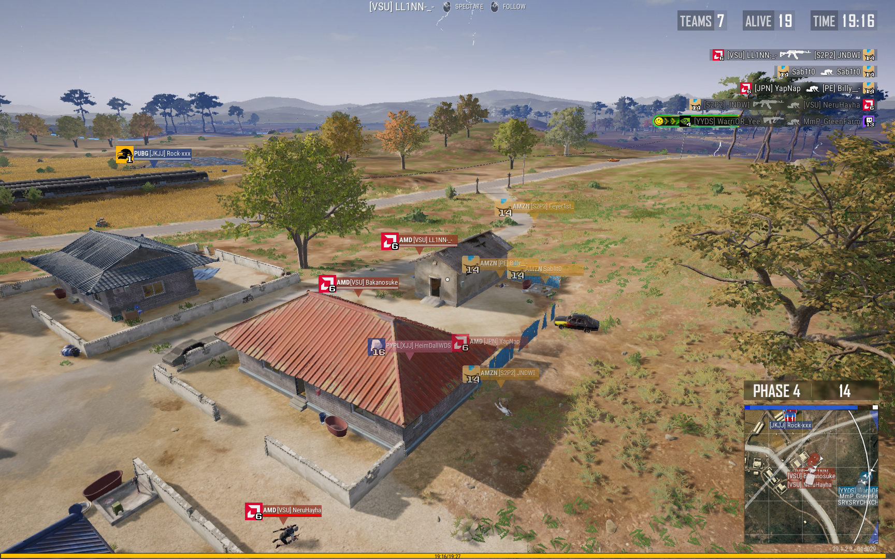

# PUBG キルフィード
## キルフィードに有名なロゴを表示します
このレポジトリではデフォルトでは数値で表示されるキルフィードを有名企業やサービスのロゴにカスタマイズするファイルを提供します。

## インストールとアップデート
インストールとアップデートは、[最新のRelease](https://github.com/JNDWI/pubg-killfeed/releases)から `install.bat` をダウンロードして実行するだけで完了する。

このスクリプトはレポジトリ内の `Observer` フォルダをあなたのPCの  `%LOCALAPPDATA%\TslGame\Saved` ディレクトリ直下に配置するだけのプログラムです。

## ナンバーレスバージョン
このスクリプトではデフォルトでロゴの右下に数字が記載されているバージョンのキルフィードを提供します。数字が必要ない場合はナンバーレスバージョンを用意しているのでそちらに置き換えてください。 `Observer` フォルダ内の `TeamIcon-numberless` フォルダの名前を `TeamIcon` に書き換えてください。

## フォント
Public Pixel https://www.cdnfonts.com/public-pixel.font

## プレビュー

