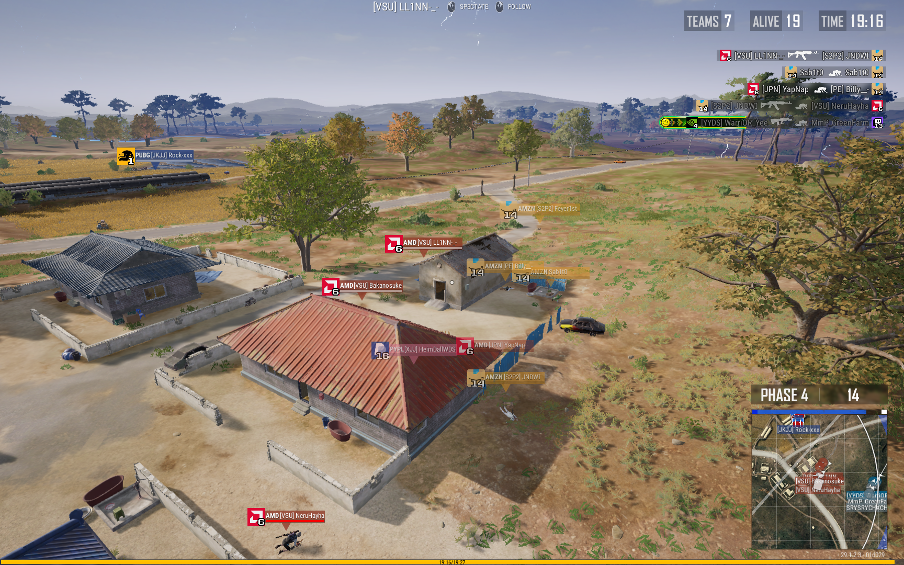

[日本語版](./README-ja.md)
# PUBG KILLFEED

## Well-Known Logos in your killfeed
This repository provides files to customize the killfeed, which is displayed by default in number, into logos of well-known companies or services.

## Install & Update
Installation and updates can be completed simply by downloading and executing `Install.bat` from the [latest release](https://github.com/JNDWI/pubg-killfeed/releases).

This script is a program that simply places the `Observer` folder from the repository directly into the `%LOCALAPPDATA%\TslGame\Saved` directory on your PC.

## Numberless Version
This script provides a version of the killfeed where numbers are displayed by default at the bottom right corner of the logo. If you don't need numbers, replace it with the numberless version. Rename the `TeamIcon-numberless` folder inside the `Observer` folder to `TeamIcon`.

## Font
Public Pixel https://www.cdnfonts.com/public-pixel.font

## Preview
